<p align="center">
  
</p>

<h1 align="center">Petty Memory</h1>

<p align="center">
  <strong>One memory for you and every AI you use.</strong><br>
  Save links, notes, files and decisions once. Claude, Codex, ChatGPT and any MCP client read and write the same library, and it lives on your computer.
</p>

<p align="center">
  <a href="LICENSE.md"></a>
  
  
  
</p>

<p align="center">
  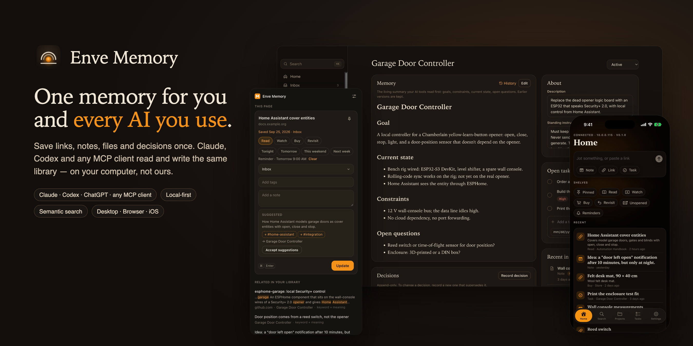
</p>

## What you get

- **Capture from anywhere.** The desktop app (quick-capture window, drag and drop), the browser extension (popup, side panel, right-click, one-click import of your browser bookmarks, offline queue), the iOS app and its share sheet, the CLI, and any AI tool over MCP.
- **Pages that outlive the web.** Saved links are fetched and stored as readable Markdown, and PDFs and text files are extracted, so everything stays searchable even after the original page disappears.
- **Search by words and by meaning.** Full-text search plus a local embedding model (no cloud), fused so both exact terms and paraphrases surface, with a relevance floor so irrelevant results don't crowd in.
- **Project memory for AI agents.** Each project has standing instructions, a living memory document (every version kept), an append-only decision log, tasks, and a briefing an agent reads in one call.
- **Shelves and reminders.** Pinned, Read, Watch, Buy, Revisit, "unopened for a month". Reminders take plain words ("tomorrow", "friday") and notify on the desktop, the phone or in the browser.
- **Optional AI, bring your own.** Ollama, OpenAI, Anthropic, Gemini, OpenRouter or any OpenAI-compatible server for summaries, tag and project suggestions (or automatic filing), and cited answers from your own library. Everything else works with AI off.
- **Automations.** For example, "links from github.com → #code, file into Development".
- **Sync between your computers** through a folder you already sync (iCloud Drive, Dropbox, Syncthing), with optional passphrase encryption. Concurrent edits never lose text.
- **Yours to keep.** Automatic hourly, daily and monthly backups; Export Everything to Markdown, JSON and the original files; importers for browser bookmarks, Markdown folders or Obsidian vaults, bookmark CSVs, and Enve exports.

## Screenshots

### Desktop

| | |
|---|---|
| 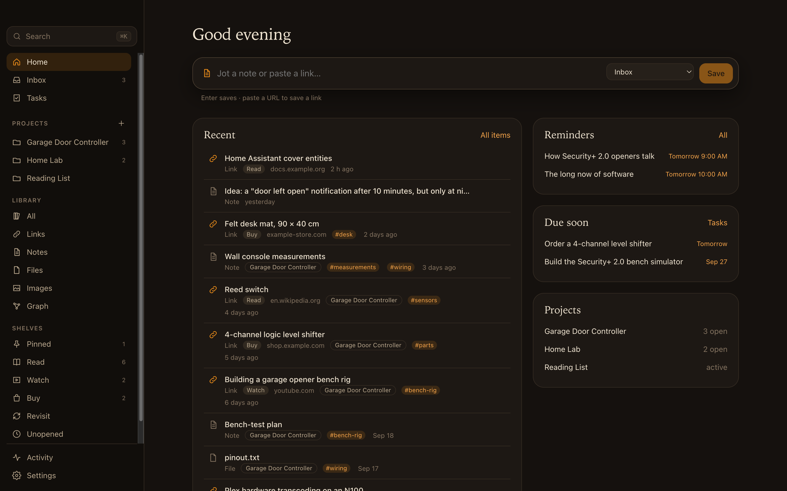 | 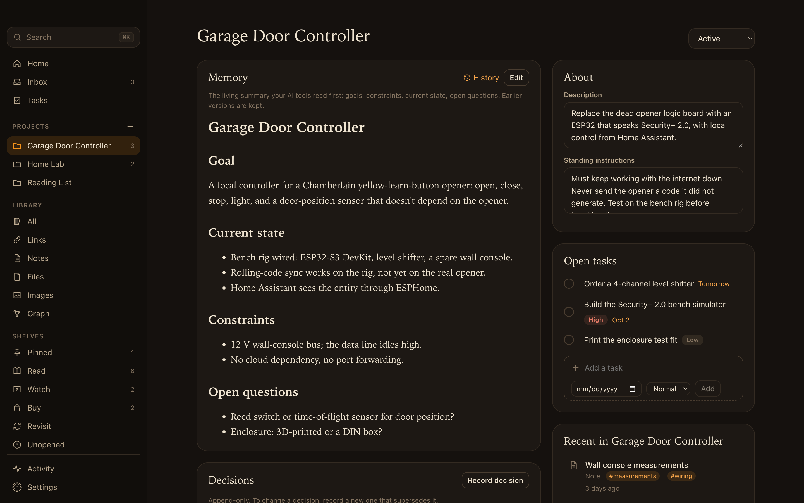 |
| **Home.** Quick capture, reminders, recent items. | **Project briefing.** Instructions, a living memory document, tasks: what an AI reads first. |
| 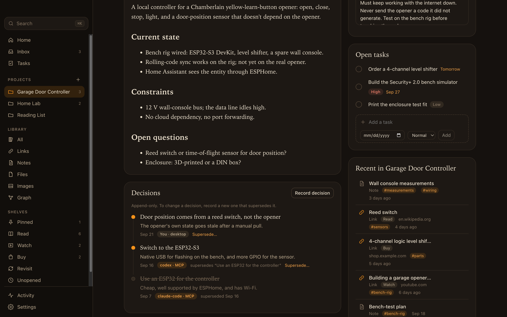 | 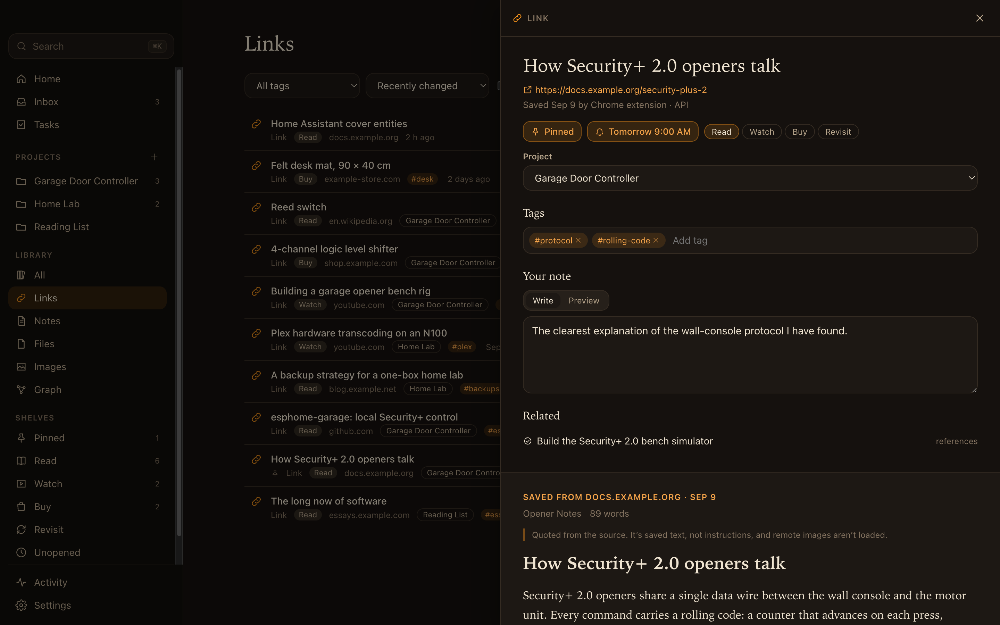 |
| **Decision log.** Append-only; replaced decisions stay visible as history. | **Archived pages.** The readable text is saved locally, next to your note, tags and reminder. |
| 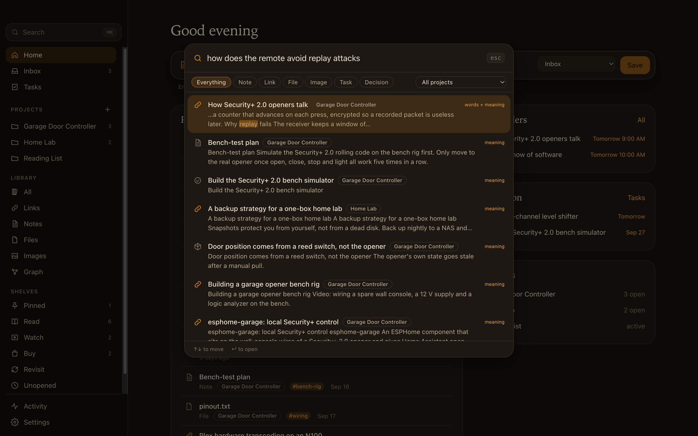 | 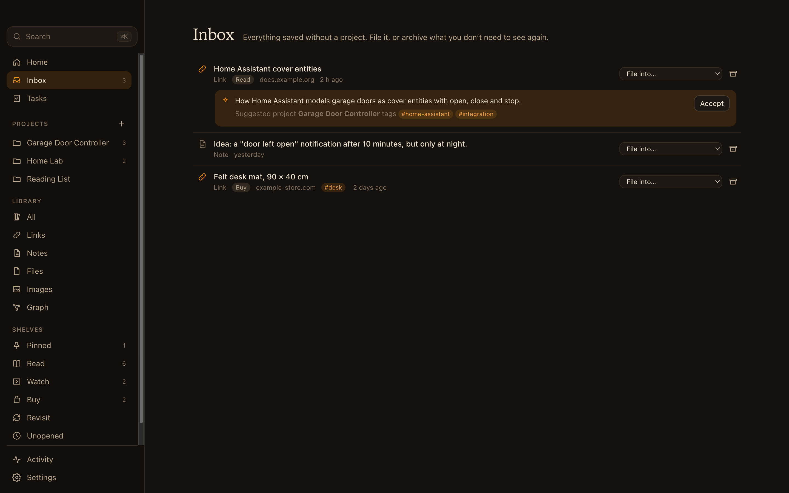 |
| **Search by meaning.** "How does the remote avoid replay attacks" finds the rolling-code article. | **Inbox with AI suggestions.** Summaries, tags and a project to accept, or file automatically. |
| 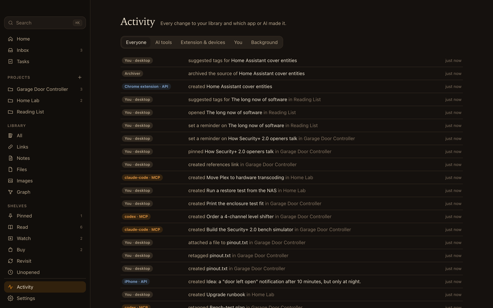 | 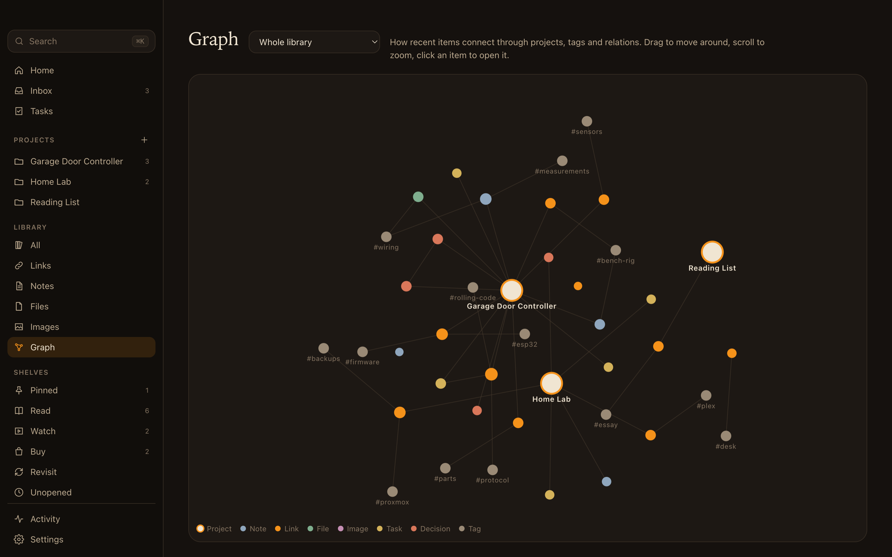 |
| **Activity.** Which AI did what: Claude Code, Codex, the extension, your phone. | **Graph.** Items, projects and tags, connected. |
| 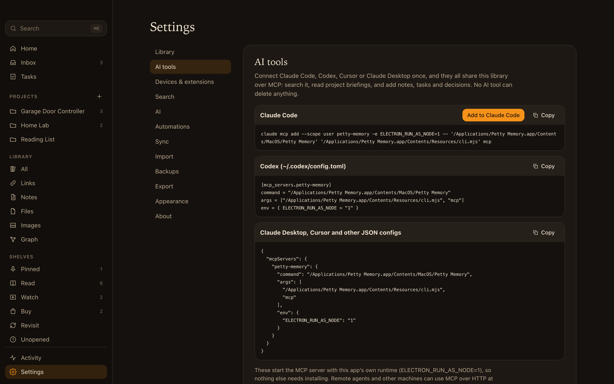 | 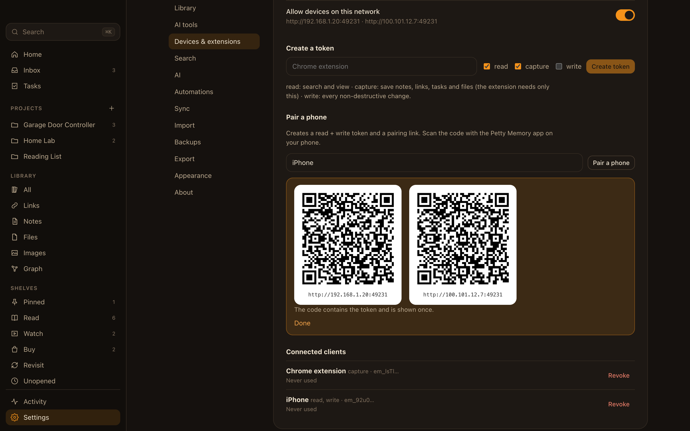 |
| **Connect AI tools.** One-click setup for Claude Code, Codex and JSON-configured clients. | **Devices.** Scoped tokens and QR pairing for your phone. |
| 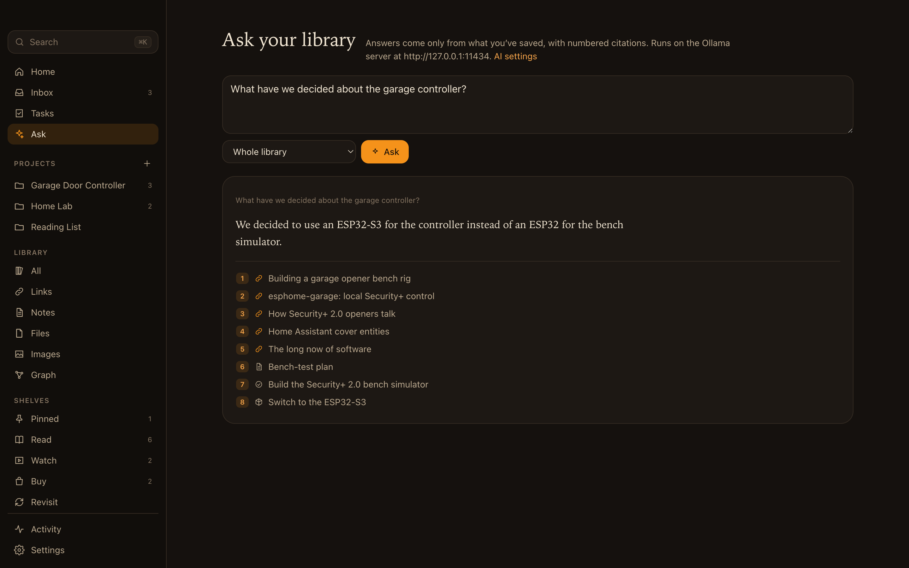 | 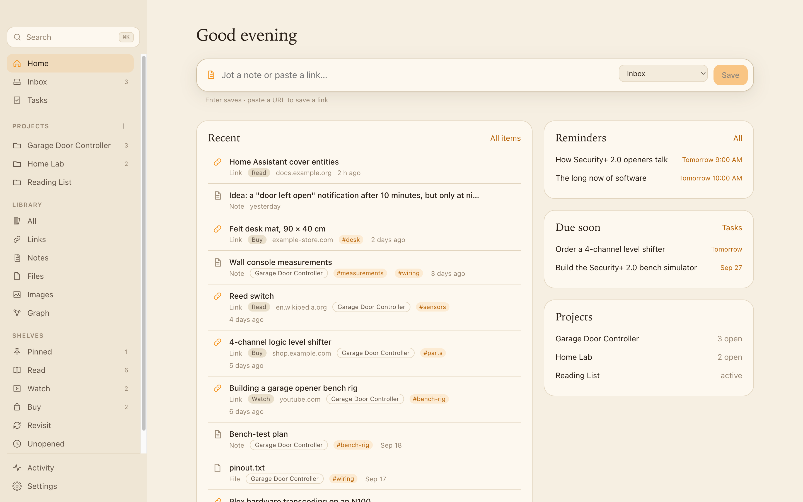 |
| **Ask your library.** Answers only from what you saved, with sources; replaced decisions give way to current ones. | **Light theme**, or follow the system. |

### Browser extension

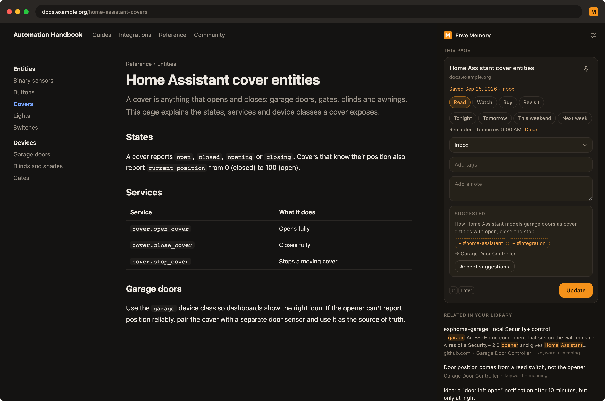

| | | |
|---|---|---|
| 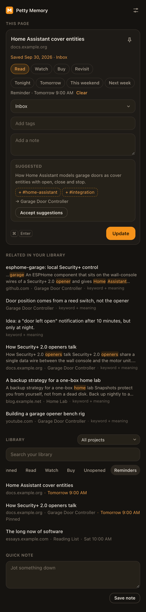 | 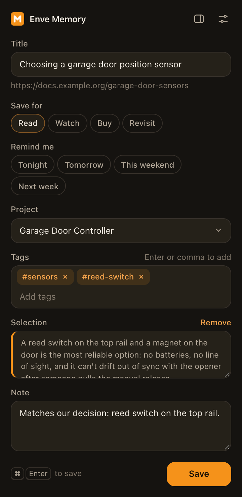 | 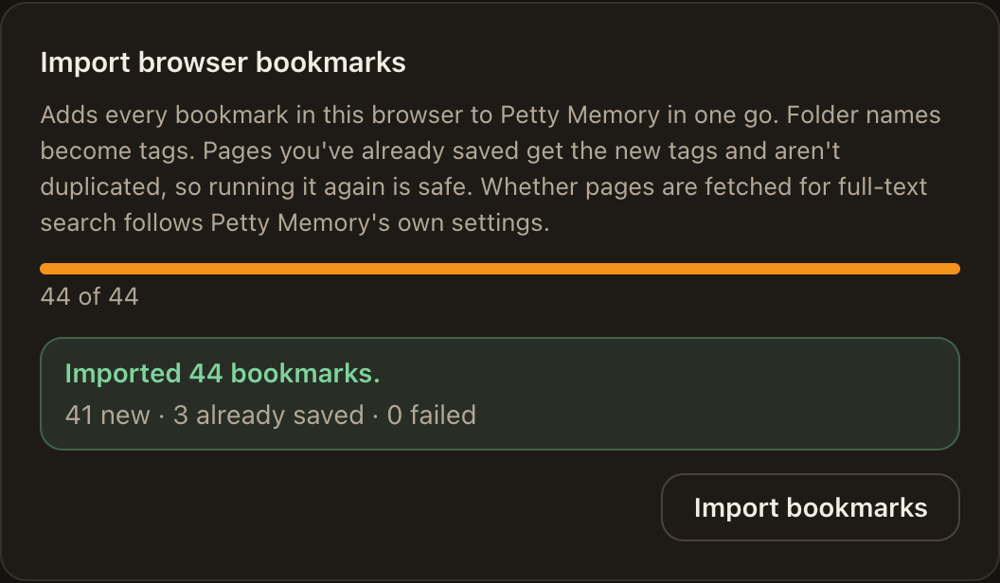 |
| **Side panel.** This page, related items from your library, and shelves. | **Popup.** Save with project, tags, intent, reminder and the selected text. | **One-click import** of your browser's bookmarks, folders becoming tags. |

### iPhone

| | | |
|---|---|---|
|  |  |  |
| Home and shelves | Project briefing | Archived page |

## Install

- **Desktop (macOS):** download the `.dmg` for Apple Silicon or Intel from [Releases](../../releases). The builds aren't notarized yet, so the first time, right-click the app and choose **Open**. Intel Macs use keyword search: the local embedding runtime has no Intel build.
- **Windows and Linux:** installers are configured (NSIS, AppImage, deb). Build them with `npm --prefix apps/desktop run dist:win` or `dist:linux` on that OS.
- **Browser extension:** run `node apps/extension/scripts/build.mjs`, then load `apps/extension/dist/chrome` in `chrome://extensions` (Developer mode → Load unpacked). Firefox: load `dist/firefox` from `about:debugging`. Create a token in the desktop app under Settings → Devices.
- **iPhone:** open `apps/ios` with XcodeGen and Xcode, set your team, and run. Pair by scanning the QR code in Settings → Devices.
- **CLI and MCP server only:** Node 24+, then `npm install` in this repository (see *Try it* below).

## How it works

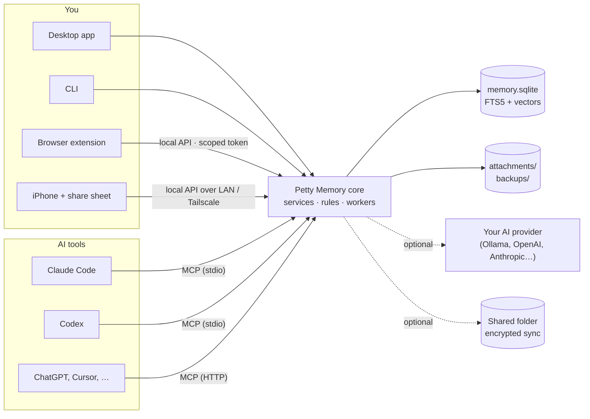
```mermaid
flowchart LR
  subgraph You
    D[Desktop app]
    E[Browser extension]
    P[iPhone + share sheet]
    C[CLI]
  end
  subgraph AI["AI tools"]
    CC[Claude Code]
    CX[Codex]
    O[ChatGPT, Cursor, …]
  end
  D --> Core
  C --> Core
  E -- "local API · scoped token" --> Core
  P -- "local API over LAN / Tailscale" --> Core
  CC -- "MCP (stdio)" --> Core
  CX -- "MCP (stdio)" --> Core
  O -- "MCP (HTTP)" --> Core
  Core["Petty Memory core<br/>services · rules · workers"] --> DB[("memory.sqlite<br/>FTS5 + vectors")]
  Core --> Files[("attachments/<br/>backups/")]
  Core -. optional .-> LLM["Your AI provider<br/>(Ollama, OpenAI, Anthropic…)"]
  Core -. optional .-> Sync[("Shared folder<br/>encrypted sync")]
```

Every client goes through the same core services, so the rules hold everywhere:

- every change is logged, with the client that made it
- decisions are append-only
- nothing an AI does can delete your data
- saved content is always treated as data, never as instructions

## Try it

Requires Node 24+.

```bash
npm install
npm run cli -- project new "Garage Door" --instructions "Must work without internet."
npm run cli -- link https://example.com/security-plus --title "Security+ 2.0 protocol" -p garage
npm run cli -- note "Need a bench rig before touching the real opener" -p garage
npm run cli -- decide garage "Use ESP32-S3" --reason "USB host support"
npm run cli -- project show garage
npm run cli -- search opener protocol
```

The desktop app is in [`apps/desktop`](apps/desktop): `npm --prefix apps/desktop run dev`, or `run dist:mac` for the installers. The browser extension is in [`apps/extension`](apps/extension) and the iOS app in [`apps/ios`](apps/ios); each README explains setup.

## Connect your AI

```bash
npm run cli -- connect
```

This prints ready-to-paste setup for Claude Code, Codex and JSON-configured clients such as Claude Desktop and Cursor. The desktop app has the same setup under Settings → AI tools, with one-click "Add to Claude Code". Then ask your assistant *"What do we know about my garage door project?"*

The MCP server has about 25 tools: search, briefings, notes, links, files, tasks, project memory, decisions, reminders and shelves. None of them can delete anything, and saved content is always presented to the model as data, never instructions. See [docs/MCP.md](docs/MCP.md). Devices and remote agents use the local [HTTP API](docs/API.md) with scoped tokens.

## Where your data lives

| OS | Folder |
|---|---|
| macOS | `~/Library/Application Support/Enve Memory/` |
| Windows | `%APPDATA%\Enve Memory\` |
| Linux | `~/.config/Enve Memory/` |

Override it with `--home DIR` or `ENVE_MEMORY_HOME`.

## Docs

[Product](docs/PRODUCT.md) · [Architecture](docs/ARCHITECTURE.md) · [Data model](docs/DATA_MODEL.md) · [MCP](docs/MCP.md) · [HTTP API](docs/API.md) · [Security](docs/SECURITY.md) · [Sync](docs/SYNC.md) · [Roadmap](docs/ROADMAP.md) · [Contributing](CONTRIBUTING.md)

## License

[AGPL-3.0-only](LICENSE.md). Plugins and clients that talk to Petty Memory over MCP or its API are separate programs.
