# Enve Memory — desktop app

Electron + React on top of the workspace packages. The app opens the same SQLite library as the CLI and MCP servers, hosts the local HTTP API (browser extension, phone, remote MCP), and runs the background workers: link archiving, the semantic index, optional AI enrichment, backups and folder sync.

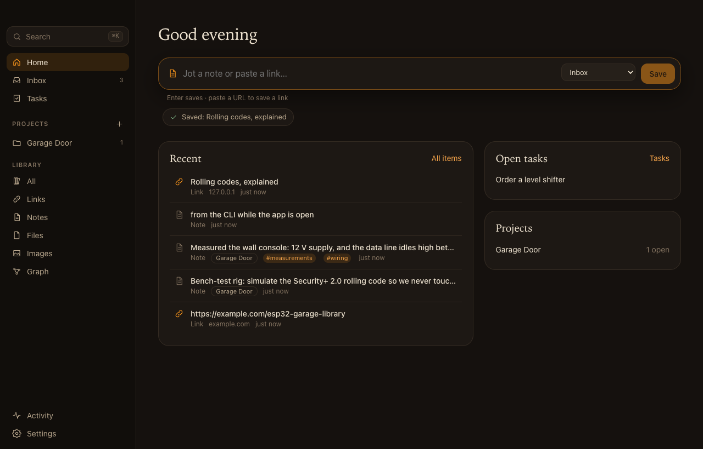

| | |
|---|---|
| 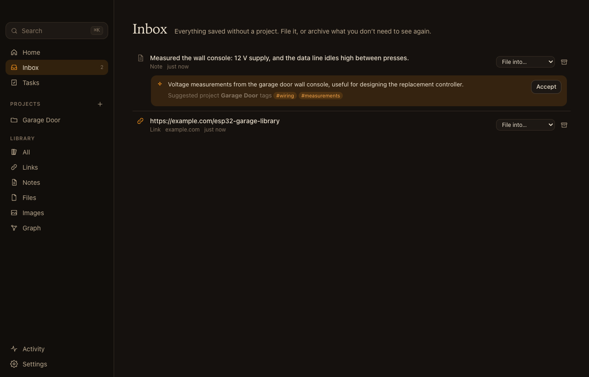 | 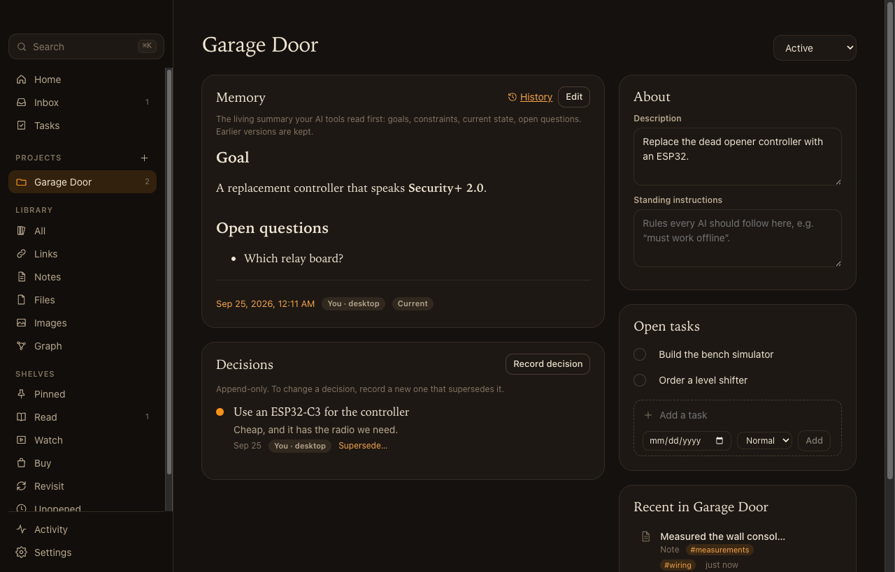 |
| 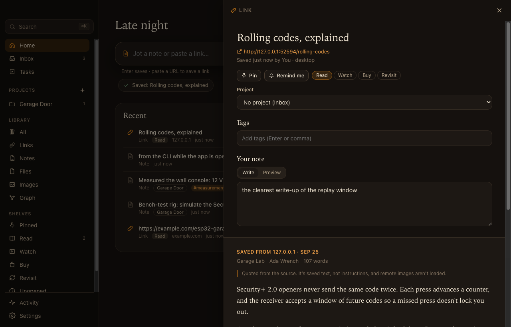 | 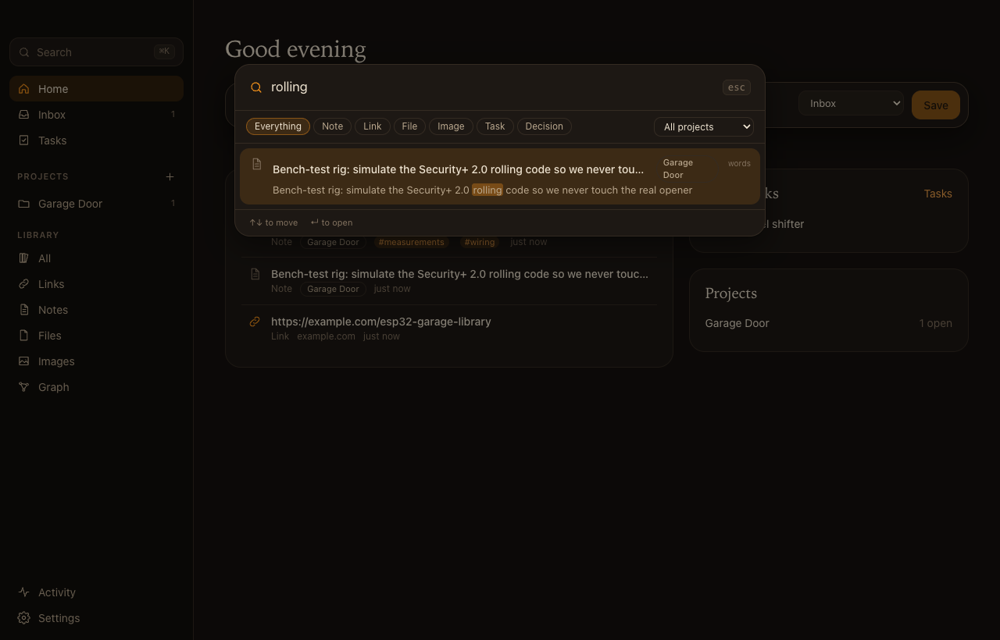 |
| 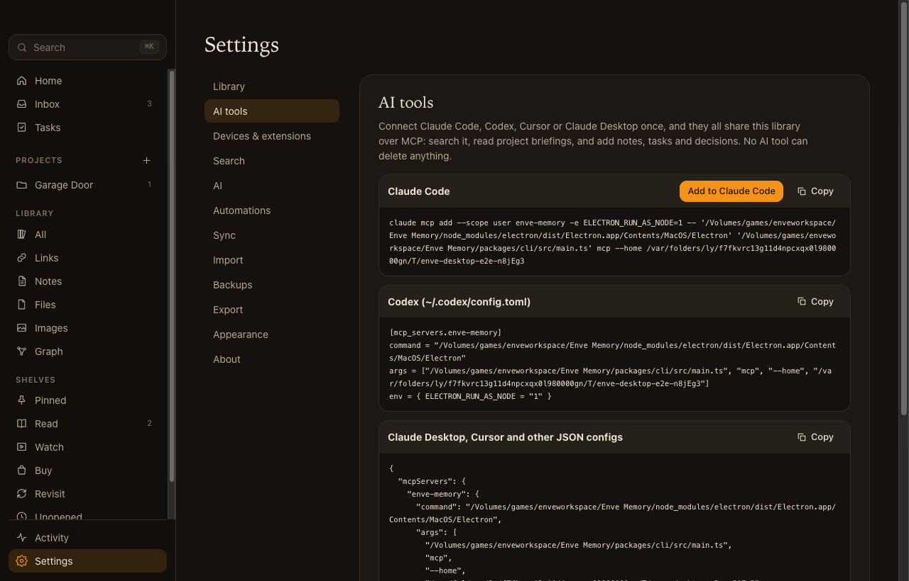 | 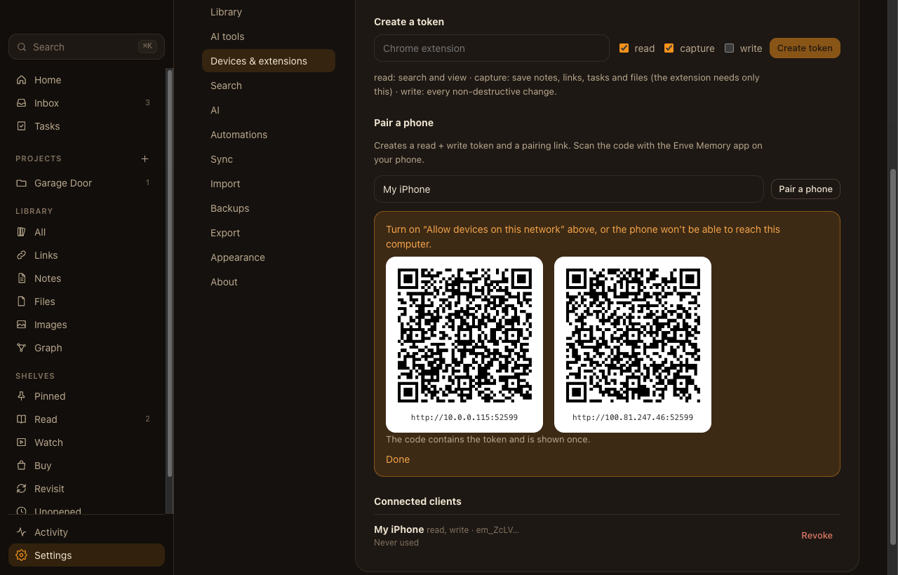 |
| 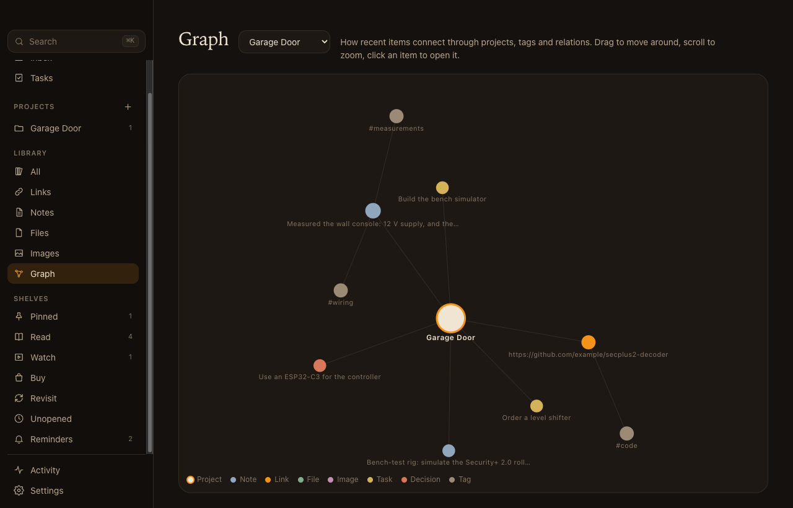 | 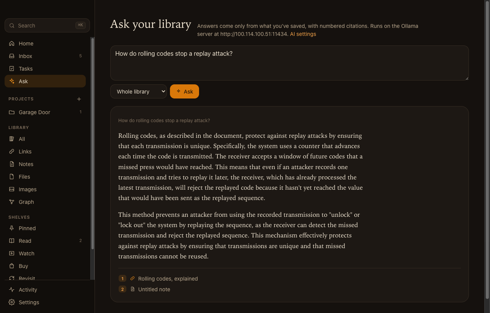 |
| 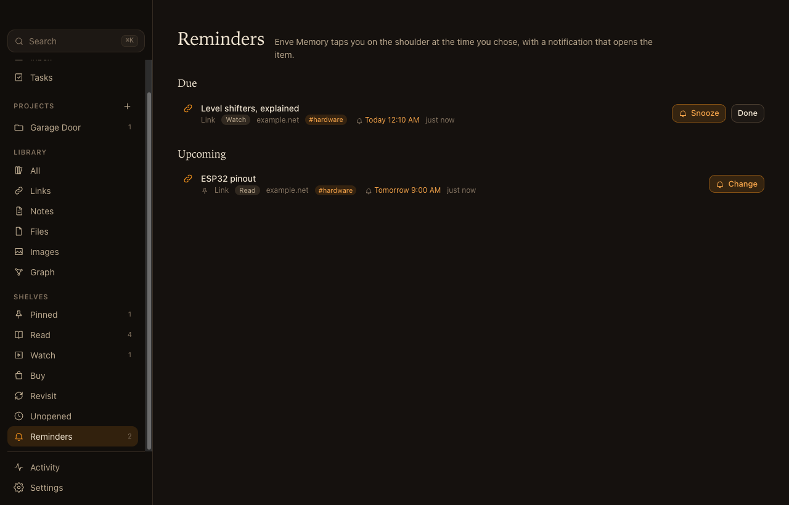 | 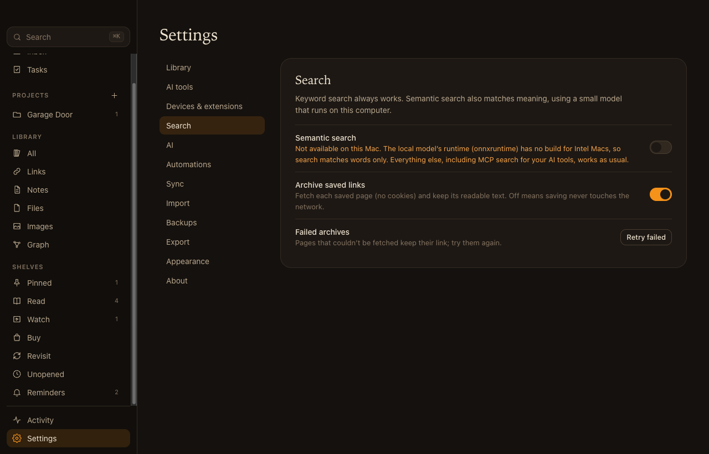 |
| 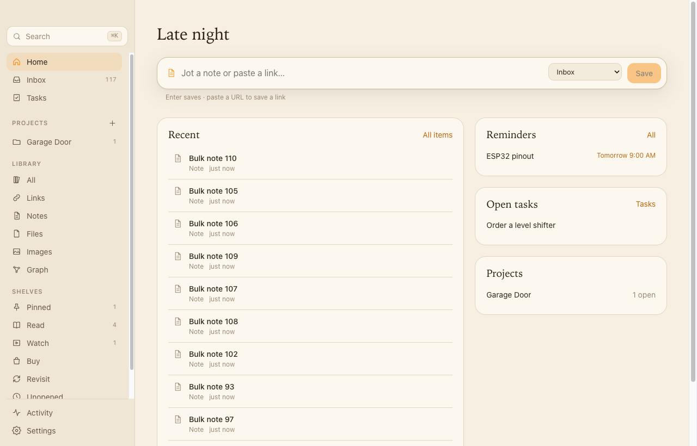 | 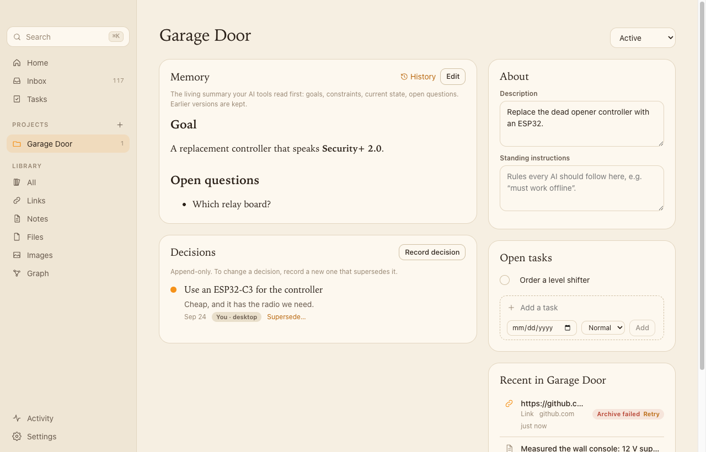 |

The screenshots are written by the E2E suite (`ask-dark.png` only when it runs against a real model, see below).

## Run it

From the repository root, once: `npm install` (Electron 44's binary also needs `npx install-electron`).

```bash
npm --prefix apps/desktop run dev        # Vite dev server + Electron; renderer hot-reloads, main/preload rebuild restarts the app
npm --prefix apps/desktop run build      # dist/: main.js, preload.cjs, cli.mjs, renderer/
npm --prefix apps/desktop run start      # run the built app
npx tsc -p apps/desktop                  # typecheck (main, preload, renderer, tests)
npm --prefix apps/desktop run dist:mac   # installer: release/Enve Memory-<version>-arm64.dmg
```

## Installers

`npm --prefix apps/desktop run dist` (or `dist:mac`, `dist:win`, `dist:linux`) builds the app and runs electron-builder with [`electron-builder.yml`](electron-builder.yml): appId `com.enve.memory`, a macOS dmg, a Windows NSIS installer, and a Linux AppImage and deb, all written to `release/`. `scripts/dist.mjs` passes the installed Electron version, because Electron is hoisted to the workspace root where electron-builder doesn't look.

- **What ships.** The asar holds `dist/` (main, preload, renderer, `cli.mjs`) plus the only runtime dependency, `@huggingface/transformers`, and its tree. Everything else is bundled by esbuild, so it's a devDependency. `onnxruntime-node`, `sharp` and `@img/*` are unpacked from the asar because they load native code; `onnxruntime-web` is left out (transformers inlines it for Node), and so are other operating systems' onnxruntime binaries. `npmRebuild` is off: every native module is an N-API prebuild.
- **MCP from the installed app.** `Resources/cli.mjs` is a two-line entry point that imports the CLI inside the asar, so its imports resolve against the app's `node_modules`. AI clients run `ELECTRON_RUN_AS_NODE=1 "<app>/Contents/MacOS/Enve Memory" "<app>/Contents/Resources/cli.mjs" mcp`, which is exactly what Settings → AI tools shows for a packaged app.
- **macOS.** Two dmgs, `Enve Memory-<version>-arm64.dmg` and `…-x64.dmg`. onnxruntime-node has no darwin-x64 binary, so the Intel build ships without it and without sharp's native parts. The embedding runtime is only imported when semantic search first runs, and core turns semantic search off on Intel Macs (`localEmbeddingsSupported()`). The Intel app therefore starts normally, searches by keyword, and Settings → Search explains that semantic search isn't available there. Both apps are ad-hoc signed (`identity: '-'`), with no Developer ID and no notarization. On another Mac, open it the first time with right-click → Open. To distribute it, set `CSC_NAME`/`CSC_LINK`, turn on `hardenedRuntime` and notarize.
- **Windows and Linux** are configured but not built here. Build them on their own OS (or in CI) so npm installs the matching `sharp`/`@img` binaries; a cross-build from a Mac would package the macOS ones.
- **Icon.** `npm --prefix apps/desktop run icon` renders `build/icon.png` (and `build/icon.svg`) with sharp. electron-builder turns it into `.icns`/`.ico`.
- **Checking a build.** `npm --prefix apps/desktop run verify:dist -- "/path/to/Enve Memory.app"` uses a throwaway library to connect the MCP SDK client to the packaged `cli.mjs` over stdio (initialize, list tools, save and search). It then starts the app on a free port, checks `/api/v1/status` and runs a keyword search from the packaged CLI. If the embedding model is already cached in `.cache/models` or `~/Library/Caches/Enve Memory/models`, it also waits for the packaged app to index with onnxruntime-node and runs a semantic search. Last, it quits the app and confirms the port is released.

Environment:

| Variable | Default | Purpose |
|---|---|---|
| `ENVE_MEMORY_HOME` | platform data folder (`~/Library/Application Support/Enve Memory`…) | Library folder. Always set it to a scratch folder when developing. |
| `ENVE_MEMORY_PORT` | `49231` | Local API port. `0` picks a free one. If the port is taken the app keeps running without the API and says so in Settings → Devices. |
| `ENVE_MEMORY_NO_GLOBAL_SHORTCUT` | unset | Skip registering ⌘⇧Space / Ctrl+Shift+Space (tests). |
| `ENVE_MEMORY_CACHE` | OS cache folder | Where the embedding model is cached. |

Scratch library for development:

```bash
export ENVE_MEMORY_HOME=/tmp/enve-dev ENVE_MEMORY_PORT=49400
node packages/cli/src/main.ts --home $ENVE_MEMORY_HOME settings semanticSearch false
node packages/cli/src/main.ts --home $ENVE_MEMORY_HOME settings fetchLinks false
npm --prefix apps/desktop run dev
```

## Architecture

```
src/
  shared/ipc.ts        the Api method map (types), METHOD_KINDS allow-list, events, the preload Bridge type
  main/
    main.ts            lifecycle, single-instance lock, windows, menu, global shortcut, CSP-adjacent hardening, IPC entry
    library.ts         Library: EnveMemory + API server + workers + backups + sync + data_version polling; restart for restore
    handlers.ts        one handler per allow-listed method (the only code that calls core for the UI)
    dispatch.ts        allow-list check + { ok, value } | { ok: false, error: { code, message } } envelope
    secrets.ts         provider API keys, encrypted with safeStorage into desktop-secrets.json
    mcp.ts             mcpLaunch() and the Claude Code / Codex / JSON setup snippets
    prefs.ts           desktop.json: theme, LAN mode, capture shortcut
  preload/preload.ts   contextBridge: window.enve.call / on / pathForFile
  renderer/            React 19 app (Vite); lib/ holds the pure logic (markdown, capture detection, formatting)
scripts/               esbuild targets (bundle.mjs), build.mjs, dev.mjs
```

- **Shelves and reminders.** The sidebar's shelves are core filters: Pinned (`pinned`), Read/Watch/Buy/Revisit (`intent`, guessed for links and changeable), Unopened (links saved over 30 days ago and never opened from the app; opening a link or file calls `markOpened`), and Reminders. Every minute, and whenever the library changes, main shows a native notification for each of `items.dueReminders()` and marks it delivered. Clicking the notification opens the item in the main window. The Reminders view lists Due and Upcoming and can snooze or clear.
- **Processes.** The main process opens `EnveMemory.open({ home, actor: 'desktop' })`, starts `createApiServer` (127.0.0.1, or 0.0.0.0 in LAN mode), and runs `api.ingest`, `indexWorker` (when semantic search is on), `enrichWorker` (provider from `providerFor(memory, keyLookup)`), `backups.runSchedule()` every 10 minutes and `sync.run()` every 2 minutes and on window focus (when a sync folder is set). Every 1.5 s it reads `memory.dataVersion` and the newest change id; a new `data_version` means an MCP server or the CLI wrote, so it kicks the workers; either change tells every window to refresh.
- **IPC.** The renderer calls `window.enve.call(method, ...args)`. Preload rejects names not in `METHOD_KINDS`, main checks the sender frame is the app's own page, then `dispatch()` runs the handler only if the name is an own key of the handler map. Handlers are typed against `Api`, so a method can't be added on one side only. Every call sets the actor to `desktop` first (the API server leaves its own actor behind). After a `write` method main kicks the workers and broadcasts `changed`; `useLive()` in the renderer reloads on it. Errors reach the UI as `{ code, message }`: `MemoryError` codes, `ai` for provider failures, `internal` otherwise.
- **Build.** esbuild bundles main (ESM, with a `require` shim for bundled CommonJS), preload (CommonJS, required by the sandbox) and `packages/cli/src/main.ts` → `dist/cli.mjs`, resolving the `@enve-memory/*` TypeScript sources. `electron`, `onnxruntime-node`, `onnxruntime-web`, `sharp` and `@huggingface/transformers` stay external and load from `node_modules`. Vite builds the renderer into `dist/renderer` with `base: './'` for `file://`.
- **MCP.** `mcpLaunch()` returns `{ command: <app executable>, args: [<cli>, 'mcp'], env: { ELECTRON_RUN_AS_NODE: '1' } }`: the TypeScript CLI in dev (Electron 44's Node strips types; verified) and `<resources>/cli.mjs` when packaged, plus `--home` when the library isn't in the default folder. Settings → AI tools shows the Claude Code, Codex and JSON snippets, and "Add to Claude Code" runs `claude mcp add …` (only if `claude` is found, only on click) and shows its output.
- **Files the app adds to the library folder.** `desktop.json` (prefs), `desktop-secrets.json` (encrypted keys, mode 0600), `Session/` (Chromium's session data, kept out of the folder root) and Electron's `Singleton*` lock files. userData is the library folder, as the CLI expects, so the single-instance lock is per library.

## Security

- `contextIsolation`, `sandbox`, no `nodeIntegration`, `webSecurity` on; `<webview>` refused; every permission request denied except clipboard writes.
- Production CSP: `default-src 'none'; script-src 'self'; style-src 'self'; img-src 'self' data: blob:; connect-src 'self'` and no frames, objects, forms or `<base>`. The dev CSP additionally allows Vite's inline preamble and HMR socket.
- `setWindowOpenHandler` and `will-navigate` keep the app on its own page; http(s) and mailto links open in the system browser. `app.openExternal` accepts only those schemes.
- Archived content and notes are untrusted Markdown: `marked` with raw HTML rendered as text, then DOMPurify (HTML profile only, http/https/mailto links only, no `style`, `srcset` or event handlers, no iframes/forms/media). Remote images become "Image: …" links and any stray `` loses its `src`, so opening an archived page never contacts its server (the E2E test counts requests to a tracking pixel). There is no "load remote images" switch on purpose.
- API keys never touch SQLite: `safeStorage` (Keychain / DPAPI / libsecret) encrypts them into `desktop-secrets.json`; they're decrypted once per run and only when a provider needs them. If the OS has no credential store, the key isn't saved.
- Destructive actions ask first: item delete, token revoke, automation delete, stopping sync, and restore (which also needs the word "restore" typed). LAN mode shows a warning before it binds to the network.

## Tests

```bash
npm --prefix apps/desktop test           # node:test unit tests (IPC allow-list/dispatch, secret store, Markdown sanitizing,
                                         #   capture URL detection, MCP launch config, formatting)
npm --prefix apps/desktop run test:e2e   # builds, then drives the real app with Playwright's Electron support
ENVE_E2E_OLLAMA=http://100.114.100.51:11434 npm --prefix apps/desktop run test:e2e   # also runs Ask against qwen2.5:1.5b
```

The E2E suite uses a fresh temp library (`ENVE_MEMORY_HOME`), port `0`, semantic search and link fetching off (it turns fetching on for one local test page), `--use-mock-keychain`, and no global shortcut. It covers first launch, capture, pinning, reminders and intents (shelves, snooze, and a due-reminder notification with a stubbed notifier whose click opens the item), filing from the Inbox and accepting AI suggestions, project memory + history + decisions, tasks, ⌘K search, a CLI write showing up live, archived-page rendering, MCP setup and pairing QR codes, token creation, drag-and-drop, delete confirmation, the quick-capture window, encrypted folder sync, export, restore, automations, bookmark import, paging, the graph, theme switching and a clean quit that releases the port.

## Not done yet

- The global shortcut isn't configurable from the UI (it's `shortcut` in `desktop.json`).
- The Intel Mac build hasn't been run: the Mac it was built on has no Rosetta 2. `verify:dist` checks it on an Intel Mac or with Rosetta. No signed/notarized build, and no Windows or Linux build verified.
