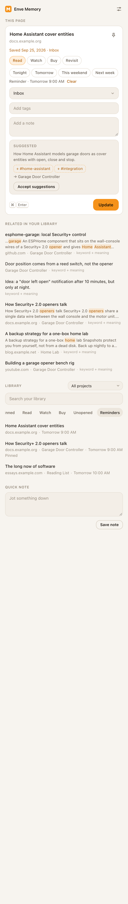

# Enve Memory browser extension

Save the page you're on, a link or a text selection to your local Enve Memory library, and find it again from a side panel next to whatever you're reading. It works in Chrome, Edge and Firefox (Manifest V3). The extension is a thin client of the local HTTP API that `enve-memory serve` (or the desktop app) runs on `http://127.0.0.1:49231`. Nothing leaves your computer, and saving keeps working when Enve Memory isn't running.


| Side panel | Side panel, light | Save popup |
|---|---|---|
|  |  |  |

## Install

Build first. This needs Node 24 or later and no dependencies:

```bash
cd apps/extension
npm run build        # writes dist/chrome and dist/firefox
```

**Chrome or Edge:** open `chrome://extensions` (or `edge://extensions`), turn on **Developer mode**, click **Load unpacked** and pick `dist/chrome`.

**Firefox (140 or later):** open `about:debugging#/runtime/this-firefox`, click **Load Temporary Add-on…** and pick `dist/firefox/manifest.json`. Temporary add-ons are removed when Firefox quits. In Firefox the side panel is the sidebar.

## Connect it

1. Start Enve Memory: open the desktop app, or run `enve-memory serve`.
2. Create a token for the browser. It's shown once:

   ```bash
   enve-memory clients add "Browser" --scope read,capture
   ```

3. The extension opens its Settings page on install. You can also right-click the toolbar button and choose **Options**. Paste the token, then click **Save**. The page tests the connection and shows the client name and scopes.

`read,capture` is all the extension needs: `read` for projects, search, shelves and "already saved" lookups, and `capture` to save, set or change the intent, pin, set reminders, and record opens and delivered reminders. With a `read,write` token you can also accept AI suggestions, clear an intent, unpin and clear reminders. The token is kept in the extension's local storage in this browser profile and is never logged.

The server URL defaults to `http://127.0.0.1:49231`. If you point it at another machine (for example `enve-memory serve --lan` over Tailscale), the browser asks for permission to reach that host when you save.

## Use it

**Side panel** (<kbd>Alt</kbd>+<kbd>Shift</kbd>+<kbd>M</kbd>, the panel button in the popup, or the toolbar button if you choose that in Settings):

- **This page:** whether the tab is saved, and one-click save or update with a note, tags and a project. You can also:
  - mark why you saved it: Read, Watch, Buy or Revisit.
  - set a reminder: Tonight, Tomorrow, This weekend or Next week.
  - pin it.
  - see the AI summary and suggested tags when Enve Memory's enrichment is on. Click a suggested tag to add it, or **Accept suggestions** with a write token.

  Once a page is saved, the intent, reminder and pin controls apply straight away. The panel follows you as you switch tabs. The first time it may ask to see which tab you're on; addresses only go to your own Enve Memory.
- **Related in your library:** saved items related to the current page.
- **Library:** search (press <kbd>/</kbd>). A small label shows whether each hit matched by keyword or by meaning. Below the search are shelves: Recent, Pinned, Read, Watch, Buy, Unopened (30 days) and Reminders, with due reminders highlighted. The project picker scopes both search and shelves. Opening a result opens it in a new tab and records the open.
- **Quick note:** jot a note into the scoped project (or Inbox) with <kbd>Cmd</kbd>/<kbd>Ctrl</kbd>+<kbd>Enter</kbd>.

**Popup** (toolbar button, or <kbd>Alt</kbd>+<kbd>Shift</kbd>+<kbd>E</kbd>): edit the title, choose an intent and a reminder, pick a project, add tags and a note, and save with <kbd>Cmd</kbd>/<kbd>Ctrl</kbd>+<kbd>Enter</kbd>. Text you selected on the page is included as a quote. On a page you've already saved, the popup lets you add to it and shows any AI suggestions.

**Instant saves:** right-click a page, selection or link and choose *Save … to Enve Memory*, or press <kbd>Alt</kbd>+<kbd>Shift</kbd>+<kbd>S</kbd> to save the current page. The toolbar badge shows ✓ for a moment (or ! on failure), with a notification. Instant saves go to the project you last picked.

**Offline:** if Enve Memory isn't reachable, saves wait in the browser and the badge shows how many. The popup and side panel show "N waiting to sync" with a **Sync now** button. The queue also syncs every minute, when the browser starts, and after any save that goes through. Each save carries an idempotency key, so a retry never creates a duplicate. If the server rejects a queued save (say its project was deleted), Settings lists it with **Retry** and **Discard**.

**Settings** also has:

- **Toolbar button:** choose whether it opens the popup or the side panel.
- **Import browser bookmarks** (pictured below): one click reads the browser's bookmark tree and sends it in batches of 500, with a progress bar and a created / already saved / failed summary. Folder names become tags; the browser's own top-level folders (Bookmarks bar, Other bookmarks…) are skipped. New bookmarks keep the date you originally bookmarked them. Pages you've already saved gain the tags instead of being duplicated, and keep their own date, so running it again is safe. Whether pages are then fetched for full-text search follows Enve Memory's own settings.
- **Mark saved links as opened when I visit them** (off by default): when you switch to a tab, its address is checked with Enve Memory's lookup, and a saved link is marked opened. Addresses only go to your own Enve Memory.
- **Show reminder notifications** (off by default, because the desktop app notifies too): checks for due reminders every five minutes and shows one notification per reminder. Clicking it opens the page. Each reminder is marked delivered in Enve Memory, so it isn't shown again here or by the desktop app.


Pages that aren't on the web (browser settings, `file:` pages) are saved as notes. You can change the shortcuts in the browser's extension shortcut settings.

### Permissions

| Permission | Why |
|---|---|
| `activeTab`, `scripting` | Read the current tab's title, address and selection when you click the extension |
| `contextMenus` | The right-click save items |
| `storage` | Settings, the offline queue and a cached project list |
| `alarms` | Retrying the offline queue and checking reminders |
| `notifications` | Save confirmations and reminders |
| `sidePanel` (Chrome) | The side panel |
| `http://127.0.0.1/*`, `http://localhost/*` | Reaching Enve Memory on this computer |
| Optional: `tabs` | Letting the side panel follow tab switches, and visit tracking |
| Optional: `bookmarks` | The one-time bookmark import |
| Optional: other hosts | Only if you point the extension at Enve Memory on another machine |

## Develop

```
src/                    shared sources for both browsers
  manifest.json         Chrome-shaped manifest; the build adapts it for Firefox
  background.js         context menus, shortcuts, the offline queue, reminders and visit tracking
  popup.*               the save popup
  sidepanel.*           the side panel (the Firefox sidebar)
  options.*             Settings
  lib/api.js            API client, payload building, error messages (pure, unit-tested)
  lib/outbox.js         the offline queue
  lib/bookmarks.js      bookmark-tree mapping and chunked import
  lib/when.js           remind-me chips and date formatting
  icons/                generated by scripts/icons.mjs
scripts/build.mjs       emits dist/chrome and dist/firefox (--pregranted adds dist/chrome-pregranted)
scripts/icons.mjs       renders the PNG icons with Node built-ins
scripts/screenshots.mjs the repository screenshots, from the demo library
```

The code is plain ES modules with no bundler. The same files run in both browsers through the small `lib/browser.js` shim. The build only rewrites the manifest. Chrome gets `background.service_worker` and `side_panel`. Firefox gets:

- `background.scripts`
- `sidebar_action`, plus `_execute_sidebar_action` for the panel shortcut
- `browser_specific_settings.gecko`

### Tests

```bash
npm test             # unit tests + the API client and offline queue against a real scratch `enve-memory serve`
npm install          # once, for Playwright
npx playwright install chromium
npm run test:e2e     # builds, then drives the extension in Chromium
```

Both suites start `packages/cli` against a temporary library on a free port, with link fetching and semantic search turned off. They never touch your real data or port 49231. `npm run test:e2e` builds `dist/chrome-pregranted`, which is the Chrome build with every optional permission granted up front, because automation can't click the browser's permission prompts. It then loads that build into Playwright's Chromium and covers:

- Settings and the popup, including AI suggestions.
- The side panel: page card, related items, search, shelves, scoping, opening results, quick note, tab following, and write-scope actions.
- The context-menu and shortcut quick saves.
- The offline queue flushing after the server restarts.
- The bookmark import from a seeded bookmark tree.
- The toolbar-button setting.
- Reminder notifications and visit tracking.

Every result is checked through the API. Screenshots taken along the way go to the git-ignored `test-results/`.

### Screenshots

```bash
npm run screenshots
```

This regenerates the images in `docs/screenshots/extension/` at the repository root. It builds a fresh copy of the fictional demo library (`scripts/demo-library.ts`) in a temporary folder and serves it on a free port with a new `read,write` token. It then loads the extension in Playwright's Chromium and serves the sample articles as `https://docs.example.org/…` through request routing, so the panel and popup show a real-looking address. Related items and search use meaning as well as keywords when the embedding model is cached in the repo (`npm run models` at the root); nothing is downloaded. Your own library is never touched.
