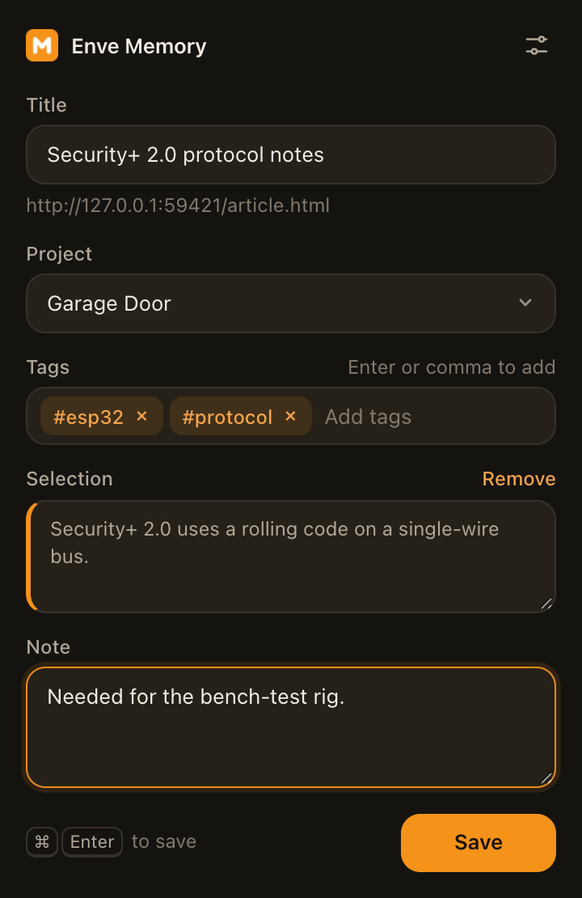

# Enve Memory browser extension

Save the page you're on, a link or a text selection to your local Enve Memory library, with a project, tags and a note. It works in Chrome, Edge and Firefox (Manifest V3). The extension is a thin client of the local HTTP API that `enve-memory serve` (or the desktop app) runs on `http://127.0.0.1:49231`. Nothing leaves your computer.



## Install

Build first. This needs Node 24 or later and no dependencies:

```bash
cd apps/extension
npm run build        # writes dist/chrome and dist/firefox
```

**Chrome or Edge:** open `chrome://extensions` (or `edge://extensions`), turn on **Developer mode**, click **Load unpacked** and pick `dist/chrome`.

**Firefox (140 or later):** open `about:debugging#/runtime/this-firefox`, click **Load Temporary Add-on…** and pick `dist/firefox/manifest.json`. Temporary add-ons are removed when Firefox quits.

## Connect it

1. Start Enve Memory: open the desktop app, or run `enve-memory serve`.
2. Create a token for the browser. It's shown once:

   ```bash
   enve-memory clients add "Browser" --scope read,capture
   ```

3. The extension opens its Settings page on install. You can also right-click the toolbar button and choose **Options**. Paste the token, then click **Save**. The page tests the connection and shows the client name and scopes.

`read,capture` is all the extension needs: `read` for projects and "already saved" lookups, `capture` to save. The token is kept in the extension's local storage in this browser profile and is never logged.

The server URL defaults to `http://127.0.0.1:49231`. If you point it at another machine (for example `enve-memory serve --lan` over Tailscale), the browser asks for permission to reach that host when you save.

## Use it

- **Popup** (toolbar button, or <kbd>Alt</kbd>+<kbd>Shift</kbd>+<kbd>E</kbd>): edit the title, pick a project (or Inbox), add tags, write a note and save with **Save** or <kbd>Cmd</kbd>/<kbd>Ctrl</kbd>+<kbd>Enter</kbd>. Text you selected on the page is included as a quote. If the page is already saved, the popup says when and lets you add a note and tags to it. The popup remembers the last project you used.
- **Right-click menu:** *Save page*, *Save selection* and *Save link to Enve Memory* save immediately. The toolbar badge shows ✓ for a moment (or ! on failure), with a notification.
- **Quick save** (<kbd>Alt</kbd>+<kbd>Shift</kbd>+<kbd>S</kbd>): saves the current page immediately.

Right-click and quick saves go to the project you last picked in the popup. Pages that aren't on the web (browser settings, `file:` pages) are saved as notes. You can change the shortcuts in the browser's extension shortcut settings.

## Develop

```
src/                 shared sources for both browsers
  manifest.json      Chrome-shaped manifest; the build adapts it for Firefox
  background.js      context menus and the quick-save command
  popup.*            the save popup
  options.*          Settings
  lib/api.js         API client, payload building, error messages (pure, unit-tested)
  icons/             generated by scripts/icons.mjs
scripts/build.mjs    emits dist/chrome and dist/firefox
scripts/icons.mjs    renders the PNG icons with Node built-ins
```

The code is plain ES modules with no bundler. The same files run in both browsers through the small `lib/browser.js` shim. The build only rewrites the manifest: Chrome gets `background.service_worker`, and Firefox gets `background.scripts` plus `browser_specific_settings.gecko`.

### Tests

```bash
npm test             # unit tests + API client against a real scratch `enve-memory serve`
npm install          # once, for Playwright
npx playwright install chromium
npm run test:e2e     # builds, then drives the extension in Chromium
```

`npm test` starts `packages/cli` against a temporary library on a free port, so it never touches your real data. `npm run test:e2e` loads `dist/chrome` into Playwright's Chromium. It configures the token through Settings, saves a page from the popup with a project, tags, a note and a selection, re-opens the popup on the saved page, and exercises the context-menu and shortcut quick-save paths in the service worker. It checks every result through the API and refreshes `docs/popup.png`.
