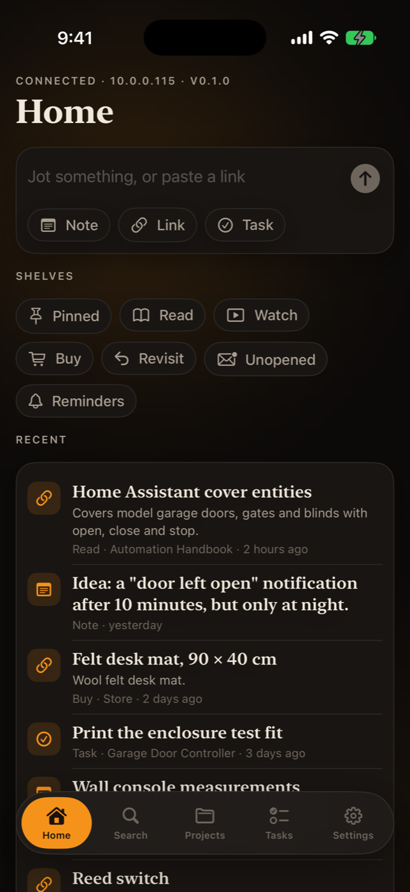
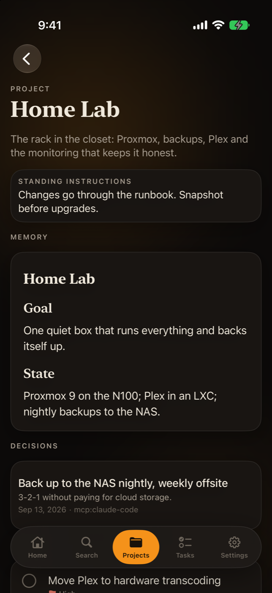
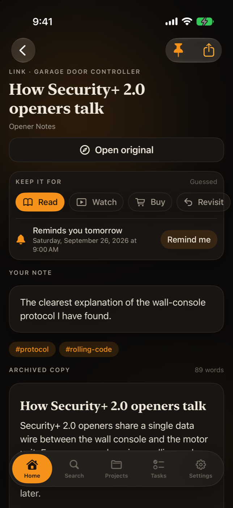
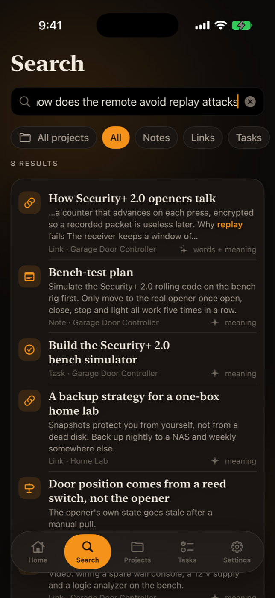
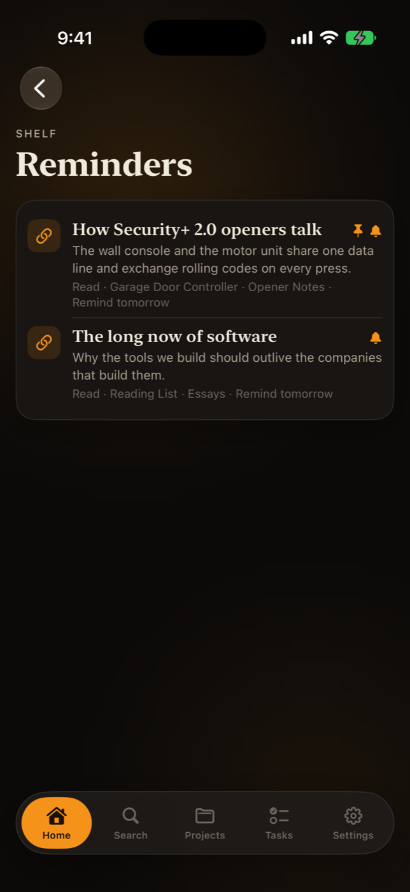
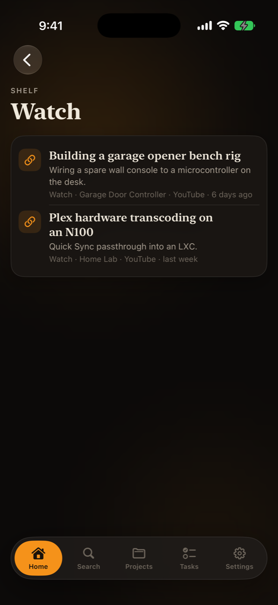
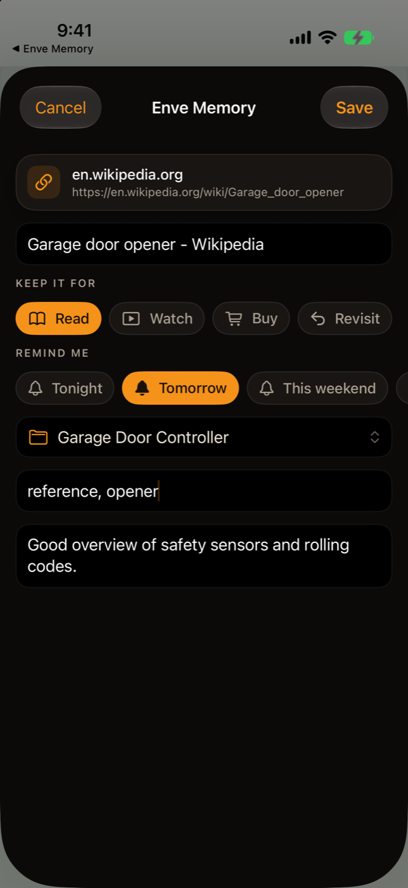
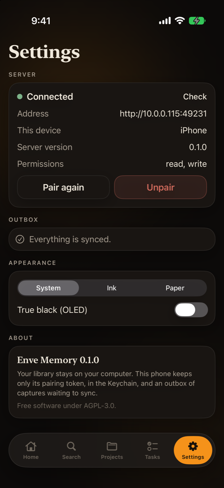
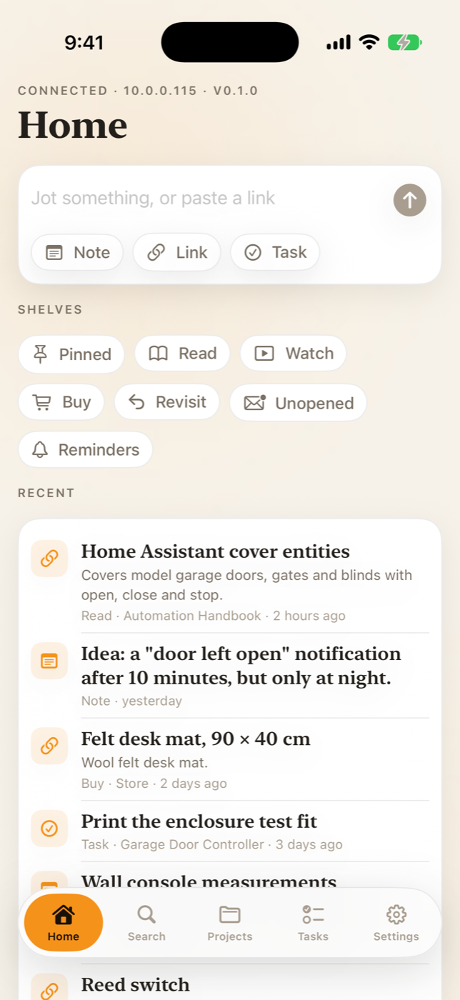

# Enve Memory for iOS

The phone companion for Enve Memory. The library stays on your computer; the phone is a client of the local HTTP API (`enve-memory serve --lan`) over your home network or Tailscale. It keeps only its pairing token (Keychain) and an outbox of captures that couldn't be sent yet.

| Home | Project briefing | Item detail |
|---|---|---|
|  |  |  |

| Search | Reminders | Watch shelf |
|---|---|---|
|  |  |  |

| Share sheet | Settings | Paper mode |
|---|---|---|
|  |  |  |

Screenshots use the fictional demo library from `node scripts/demo-library.ts <empty folder>`.

## Requirements

- Xcode 26 or newer, iOS 17.0+ deployment target, Swift 6 language mode.
- [XcodeGen](https://github.com/yonaskolb/XcodeGen). The `.xcodeproj` is generated from `project.yml`; run `xcodegen generate` after adding files or changing `project.yml`.
- An Enve Memory server: `enve-memory serve --lan` on the computer that holds the library.

## Build and run

```bash
cd apps/ios
xcodegen generate
xcodebuild -project EnveMemory.xcodeproj -scheme EnveMemory \
  -destination "platform=iOS Simulator,name=iPhone Air" build
```

To run on a device, set `DEVELOPMENT_TEAM` in `project.yml` (both targets share it) and register the App Group `group.com.enve.memory` for `com.enve.memory` and `com.enve.memory.share`. Simulator builds are ad-hoc signed and need no team.

## Pairing

On the computer:

```bash
enve-memory serve --lan
enve-memory clients pair "My iPhone"      # prints enve-memory://pair?url=…&token=…&name=… links, one per network address
```

Then on the phone, either:

- **Scan** the QR code of a pairing link (camera, real devices only),
- **Open** the link (AirDrop it, or tap it in Messages or Notes). If the phone is already paired it asks before replacing the pairing,
- **Paste** the link on the onboarding screen, or
- **Enter** the server address (`http://192.168.1.20:49231`) and the `em_…` token by hand.

Nothing is stored until `GET /status` and `GET /whoami` both succeed. Settings shows the address, device name, server version and granted scopes. Unpairing deletes the token from the phone; revoke it on the computer with `enve-memory clients revoke <id>`.

For the simulator, which shares the Mac's network, a loopback link works without `--lan`:

```bash
enve-memory --home /tmp/em serve --port 49871
enve-memory --home /tmp/em clients pair "iPhone Sim" --port 49871 --json   # take the token from the output
xcrun simctl openurl <udid> "enve-memory://pair?url=http%3A%2F%2F127.0.0.1%3A49871&token=<token>&name=iPhone+Sim"
```

## What it does

- **Home**: a quick-capture bar (a bare URL becomes a link, anything else a note), shortcuts to new note, link and task, the outbox status, and recent items 30 at a time ("Show older" follows the server's `before=<updatedAt>,<id>` cursor).
- **Shelves** (on Home): Pinned, Read, Watch, Buy, Revisit, Unopened (30 days) and Reminders, each a filtered `/items` list.
- **Search**: debounced hybrid search with type and project filters. Matched terms are highlighted, and each hit notes quietly whether it matched on words, meaning or both.
- **Projects**: the same briefing an AI gets from `get_project`, with standing instructions, the memory document rendered as Markdown, the decision log (superseded decisions struck through and dimmed), open tasks you can complete, and recent items.
- **Tasks**: active tasks grouped by project, with due dates and priority, loaded 50 at a time as you scroll (`offset`). Tap the circle or swipe to complete.
- **Item detail**: pin toggle, intent chips (Read / Watch / Buy / Revisit, marked "Guessed" while the server's guess stands), a "Remind me" menu (Tonight, Tomorrow, This weekend, Next week, or a picked date and time), the AI summary with suggested tags and project and an Accept button, title, site, byline and date, your note, tags, the task card, attachments (downloaded and previewed with Quick Look), the archived copy in a quiet reading column, relations, and "Open original" in Safari. Archived text is data: only `http`, `https` and `mailto` links in it are followed.
- **Share extension**: accepts links, text, images and files from any share sheet. Links and files get intent chips, every share gets "Remind me" chips (files send them as `X-Intent` / `X-Remind` headers), and every share gets a project picker (from the cached project list), tags and a note. Links and text go to `POST /capture`, files stream to `POST /files`. When the server can't be reached the share goes to the outbox and the sheet says "Saved — will sync when you're back on your network".
- **Outbox**: every write (captures, new items, task completions, uploads) goes straight to the server when it can and into the outbox when it can't. The app flushes it on launch and foreground, every 20 s while something is waiting (honouring backoff), and from a `BGAppRefreshTask`. Settings lists queued entries with retry and discard.
- **Reminders as local notifications**: after every sync (launch, foreground, each write, background refresh) the app mirrors `GET /reminders` into `UNUserNotificationCenter` requests keyed `enve-memory.reminder.<item id>`, adding, moving and cancelling as the server changes, so the phone reminds you even when it can't reach the server. Tapping one opens `enve-memory://item/<id>`. Permission is asked the first time you set a reminder (or from the Reminders shelf), never at launch. A capture or share that sets a reminder schedules its notification right away (the share extension only when the app already has permission): under the item's id when the server answered, or under the outbox entry's id while it waits, which the first sync after the entry is sent swaps for the real one.
- **Opened signal**: "Open original" and attachment previews report `POST /items/:id/opened`, which drives the Unopened shelf.
- **Appearance**: System, Ink and Paper modes plus true-black OLED, shared with the share extension.

## Architecture

```
apps/ios/
  project.yml                XcodeGen spec: app, share extension, package tests in the scheme
  Packages/EnveMemoryKit/    Foundation-only Swift package shared by both targets
    Models.swift             Codable models matching packages/core/src/types.ts
    Endpoint.swift           Every API call as a Codable value (the outbox persists these)
    APIClient.swift          async/await URLSession client, file upload/download
    APIError.swift           {error:{code,message}} → typed errors, retryability
    Pairing.swift            Pairing link parser, stored pairing
    CredentialStore.swift    Keychain store in the App Group access group
    Outbox.swift             File-per-entry queue in the App Group container, backoff, idempotent flush
    AppGroup.swift           Shared container paths and settings (project cache, theme)
    Share.swift              NSItemProvider → SharedContent → API calls
  Shared/                    SwiftUI compiled into both targets
    Design/                  Hearth tokens: palette, type, spacing, radius, cards, chips, buttons, background
    Components/              ProjectPicker
  EnveMemory/                App target
    App/                     App entry, root view, router, Mantel dock
    Services/                Connection, OutboxService, ProjectStore (@Observable, injected via @Environment)
    Components/              Markdown renderer, item rows, empty/error states
    Features/                Onboarding, Home, Search, Projects, Tasks, Items, Capture, Settings
  EnveMemoryShare/           Share extension (UIHostingController + SwiftUI sheet)
```

Design choices worth knowing:

- **Every write carries an `Idempotency-Key`.** The key is generated when the request is built and persisted with the outbox entry, so the direct attempt and every retry, including from the share extension, share one key. If a response is lost after the server applied the write, the retry gets the original response (`Idempotent-Replayed: true`) instead of creating a second item.
- **Reminder words are resolved on the phone.** "Tonight" becomes an ISO time (20:00, 9:00 or Saturday 10:00, matching the server's rules) in the phone's time zone at the moment you tap it, so a capture that waits in the outbox until tomorrow still means tonight.
- **One path for writes.** `OutboxService.submit` tries the server and falls back to the outbox only for retryable failures (unreachable, timeouts, 5xx, 401). A 400 or 413 is shown to the user, since resending the same request can't succeed.
- **The share extension never flushes.** It tries the server once, and anything left goes to the outbox for the app to send. Only one process drains the queue, so flushing never double-sends in-process; concurrent `flush` calls collapse into one.
- **The pairing lives in the Keychain** as one item in the `group.com.enve.memory` access group, accessible after first unlock (so background refresh works while the phone is locked). If an unsigned build lacks the entitlement, the store falls back to the app's default access group.
- **The design system is ported, not linked.** `Shared/Design` is a trimmed copy of Hearth, the design system the other Enve apps share: ink/paper/OLED palettes with the ember accent `#F5921A`, serif display type on text styles (so Dynamic Type applies live), the 4 pt spacing rhythm, radii (inner 14, card 20, bar 30), the floating Mantel dock with a published `bottomBarInset`, and a Reduce Motion-aware ambient background. Long text sits on opaque surfaces with no glow behind it.

## Tests

The package tests use Swift Testing and run on macOS or the simulator:

```bash
cd apps/ios/Packages/EnveMemoryKit && xcrun swift test          # macOS, a few seconds
cd apps/ios && xcodebuild test -project EnveMemory.xcodeproj -scheme EnveMemory \
  -destination "platform=iOS Simulator,name=iPhone Air"
```

(`xcrun swift` avoids a stale toolchain that `swiftly` may put first on `PATH`.)

They cover the new item fields (tags, intent, pin, opened, reminder, AI suggestions, search previews), shelf queries, reminder presets (including a daylight-saving change), the pure reminder plan (what to schedule, replace and cancel given the server's list, capped at 60 because iOS keeps 64 pending), item deep links, idempotency keys (fresh per write, kept across a lost response and the outbox retry), paging parameters and cursors, pairing-link parsing (valid, invalid and missing fields, `+` as space), request building (paths, strict query and header percent-encoding, bodies), error mapping through a `URLProtocol` stub (envelope codes, non-envelope statuses, connection failures, decoding), the outbox (persistence, ordering, concurrent flushes, backoff schedule, permanent failures, file uploads, removal), JSON decoding of responses captured from a real `enve-memory serve` 0.1.0 (`Tests/EnveMemoryKitTests/Fixtures`), and the share extension's item-provider → payload conversion.
